# foodBook
A recipe app that uses the Spoonacular API.  
Based and further expanded on https://github.com/stevdza-san/Foody

Recipes fragment:  
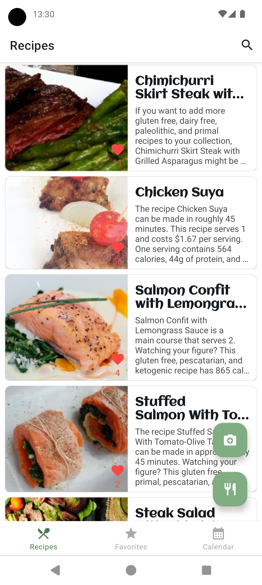
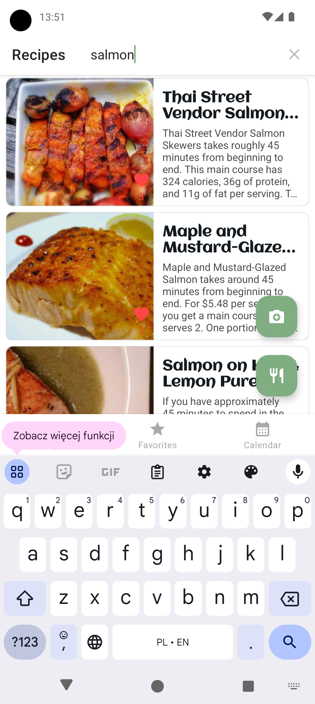

Product scanner:  
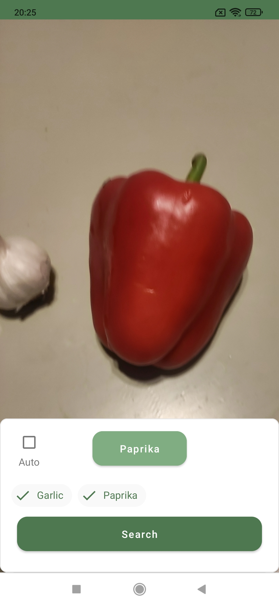

Details activity:  
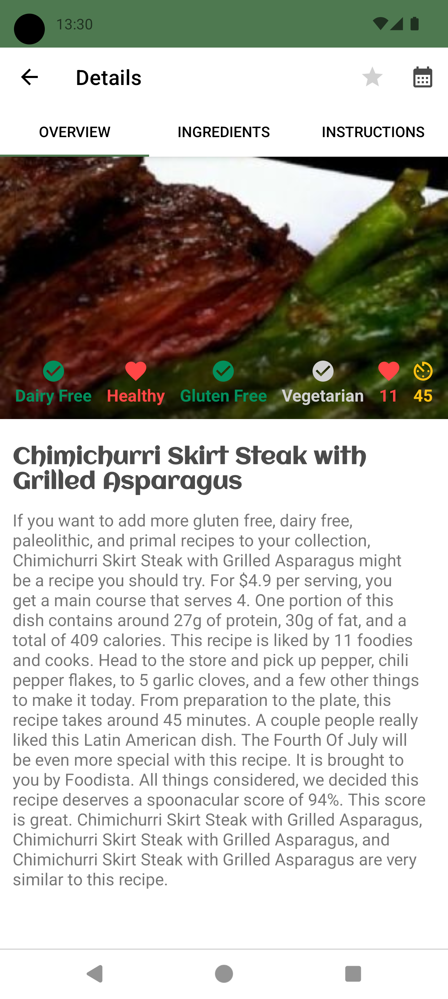
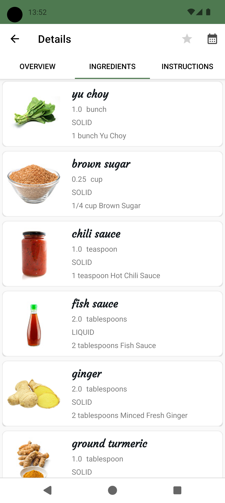
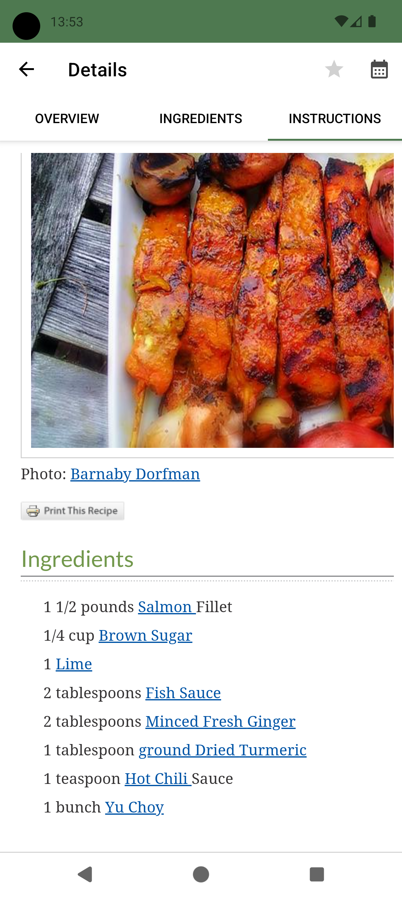

Favorites fragment:  
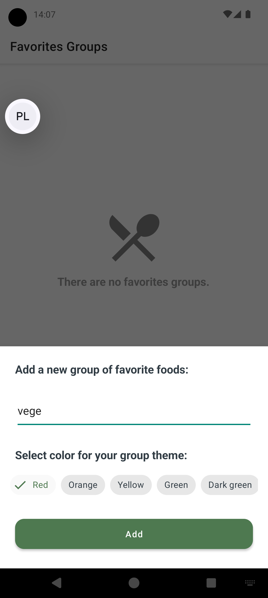
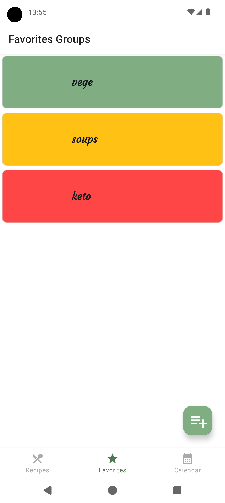
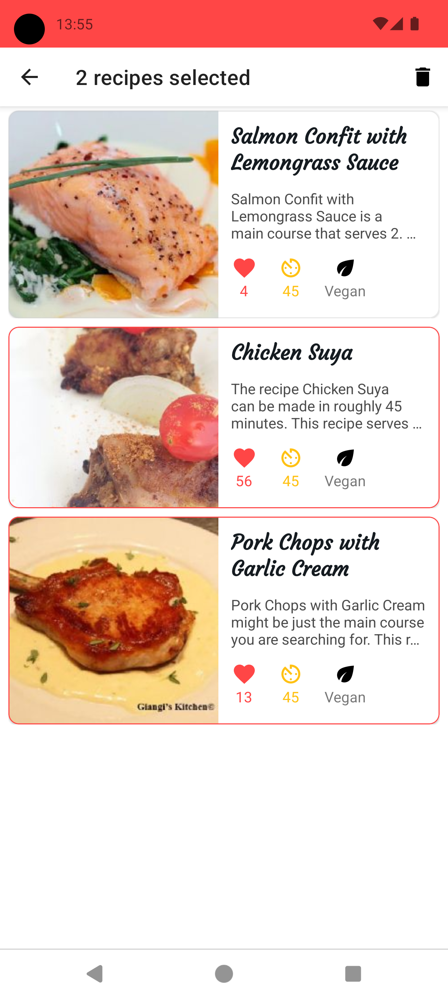

Calendar fragment and copied to notepad generated shopping list:  
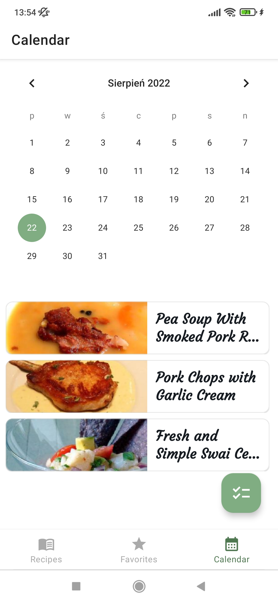
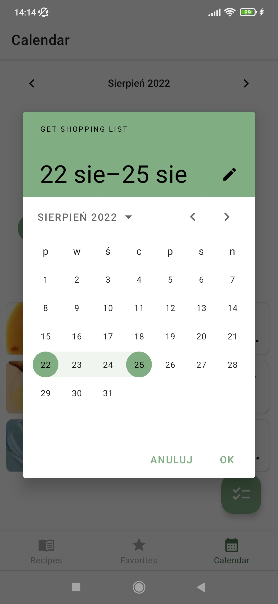
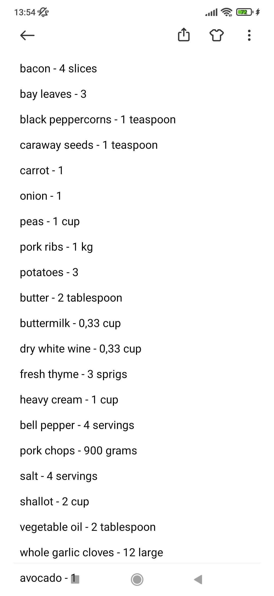
