# foodBook
A recipe app that uses the Spoonacular API.  

Recipes fragment:  

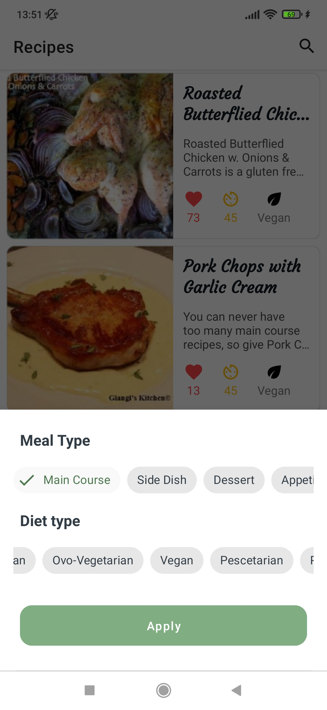
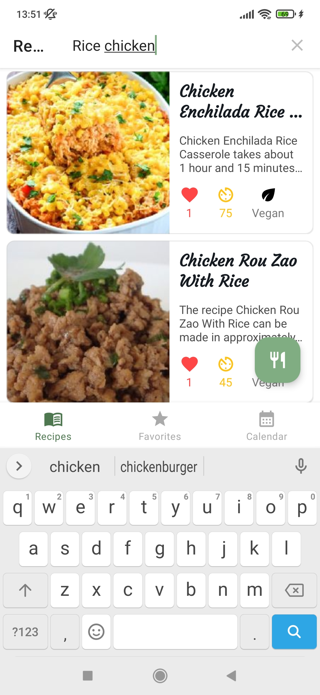

Product scanner:  

Details activity:  
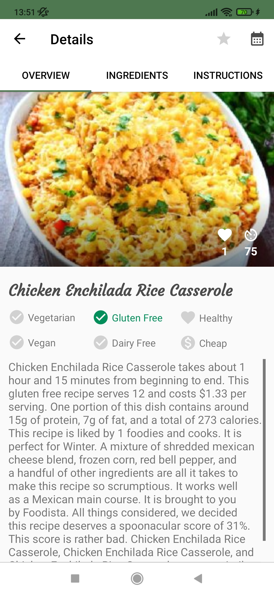
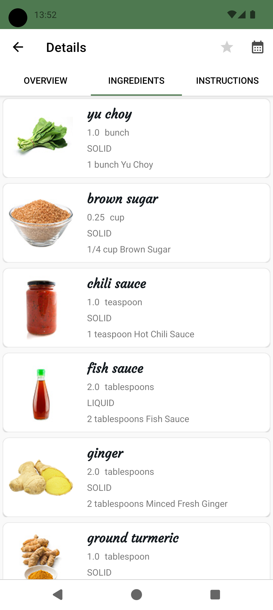
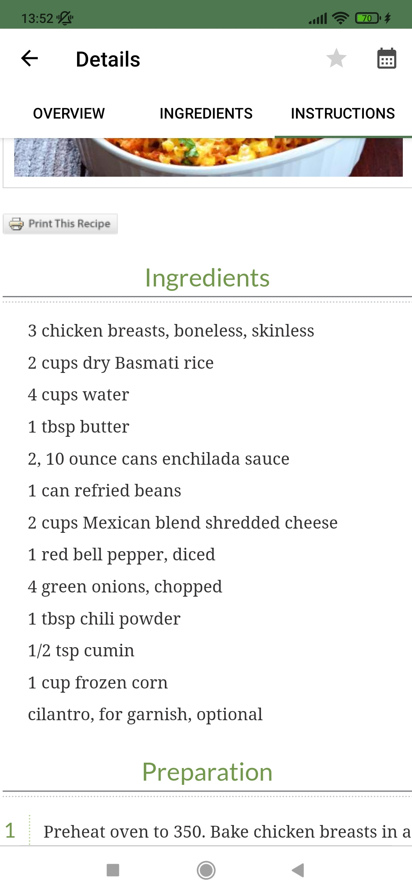  

Favorites fragment:  
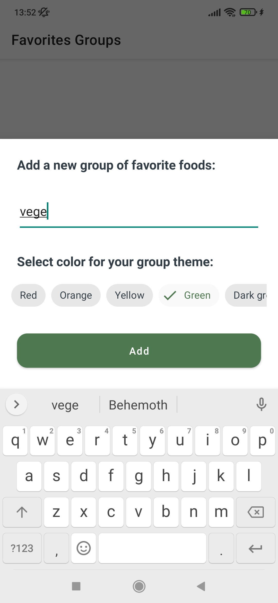
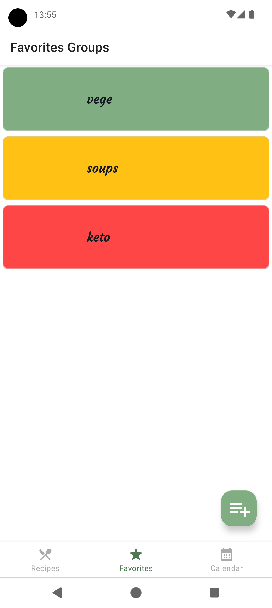
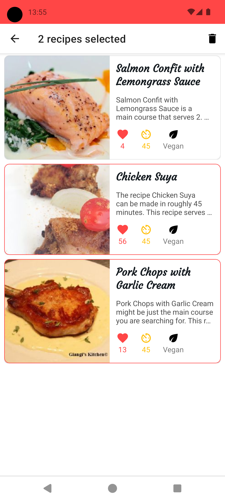  

Calendar fragment and copied to notepad generated shopping list:  
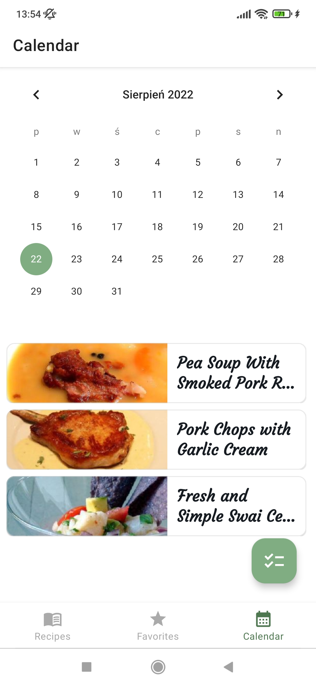
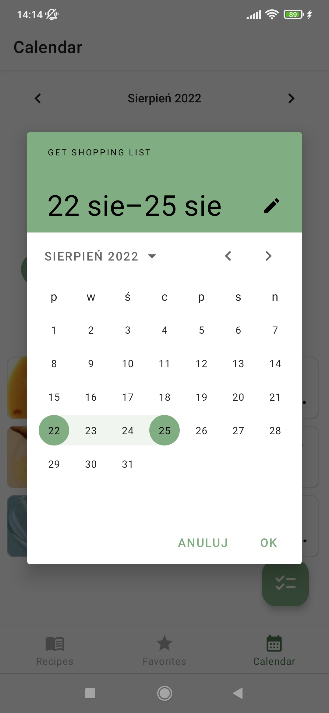
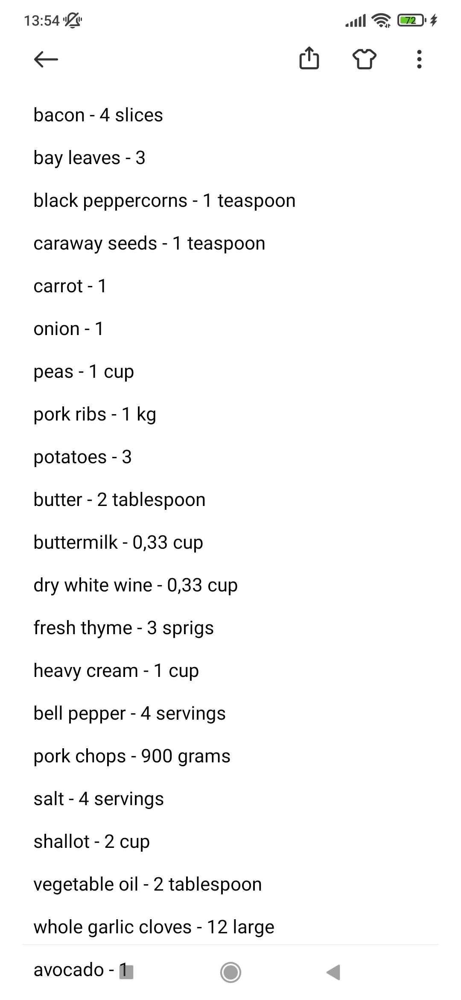
