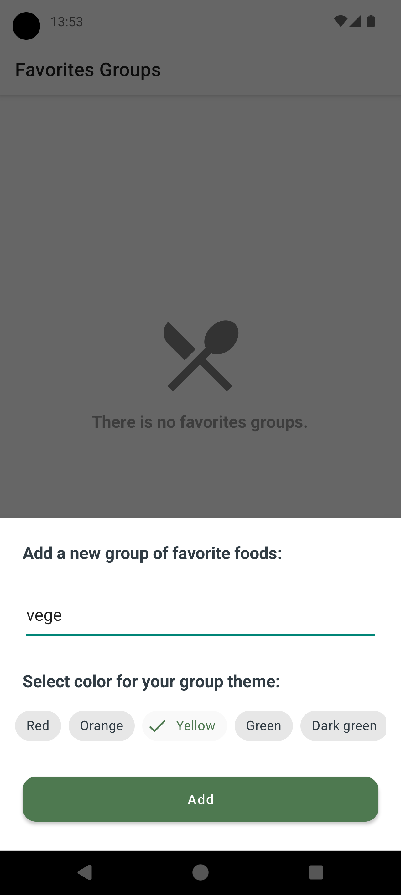

# foodBook
A recipe app that uses the Spoonacular API.  

Recipes fragment:  

Product scanner:  

Details activity:  

  

Favorites fragment:  

  

Calendar fragment and copied to notepad generated shopping list:  

